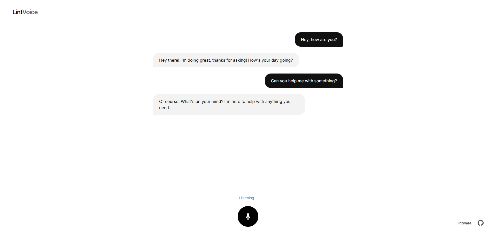

# Voice Agent - Real-time AI Voice Conversation System

A sophisticated real-time voice conversation agent featuring streaming speech-to-text, AI-powered responses, and text-to-speech capabilities. Built with state-of-the-art ML models optimized for Apple Silicon.

  

## 📸 Preview

<p align="center">
  
</p>

> **Minimalist UI** with real-time conversation display, streaming transcription, and voice controls.

## 🚀 Quick Deploy

### One-Command Setup

```bash
# Clone and setup
git clone https://github.com/yourusername/voice-agent.git && cd voice-agent

# Install and run
python3.10 -m venv venv && \
source venv/bin/activate && \
pip install -r requirements.txt && \
python app.py
```

**That's it!** 🎉 Open `http://localhost:3003` in your browser.

> ⏱️ **First Launch**: Models download automatically (~4GB). Takes 5-10 minutes.
>
> ⚡ **Subsequent Launches**: Under 30 seconds.

### System Requirements

- **macOS** with Apple Silicon (M1/M2/M3)
- **Python 3.10+**
- **~5GB** disk space
- **8GB RAM** minimum (16GB recommended)

## 📖 How to Use

1. Open `http://localhost:3003` in your browser
2. Allow microphone access when prompted
3. Click **"Start Conversation"**
4. Speak naturally - AI responds with voice + text
5. Click **"Stop Conversation"** when done

**Tips:**
- Use headphones to prevent echo
- Speak clearly in a quiet environment
- Wait for AI to finish before speaking again

## ⚙️ Configuration

### Adjust Response Speed

Edit `vad_config.py`:

```python
ACTIVE_PRESET = 'very_responsive'  # ~1s silence (fastest)
# ACTIVE_PRESET = 'balanced'       # ~2s silence (default)
# ACTIVE_PRESET = 'patient'        # ~3s silence (most patient)
```

Restart server after changes.

### Change Port

Edit last line of `app.py`:

```python
socketio.run(app, host='0.0.0.0', port=3003)  # Change 3003
```

## 🏗️ Architecture

```
Microphone → VAD → Speech-to-Text → LLM → Text-to-Speech → Speaker
```

**Components:**
- **VAD**: Silero VAD for voice activity detection
- **STT**: Parakeet TDT 0.6B v3 (streaming transcription)
- **LLM**: Qwen 3-4B 4-bit (AI responses)
- **TTS**: Kokoro TTS (voice synthesis)

**Features:**
- Real-time streaming at every stage
- Per-session state for multiple users
- Conversation history and context
- Barge-in support

## 🔧 Troubleshooting

### Python 3.10 not found
```bash
brew install python@3.10
```

### Port already in use
```bash
lsof -ti:3003 | xargs kill -9
```

### Microphone not working
- Check browser permissions (Settings → Privacy → Microphone)
- Check system permissions (System Settings → Privacy & Security)

### Models won't download
Check internet connection and try manual download:
```bash
python -c "from parakeet_mlx import from_pretrained; from_pretrained('mlx-community/parakeet-tdt-0.6b-v3')"
```

## 🚢 Run in Background

```bash
nohup python app.py > server.log 2>&1 &
tail -f server.log  # Monitor logs
pkill -f "python app.py"  # Stop server
```

## 📊 Performance

| Metric | Value |
|--------|-------|
| First startup | 5-10 min (model download) |
| Subsequent startup | 20-30 sec |
| Transcription latency | ~500ms |
| LLM response start | 1-2 sec |
| Memory usage | 4-6 GB |

*Tested on MacBook Pro M2, 16GB RAM*

## 🤝 Contributing

Contributions welcome!

1. Fork the repository
2. Create feature branch: `git checkout -b feature/amazing-feature`
3. Commit changes: `git commit -m 'Add feature'`
4. Push to branch: `git push origin feature/amazing-feature`
5. Open Pull Request

## 📜 License

MIT License - see [LICENSE](LICENSE) file.

You can use, modify, and distribute freely with attribution.

## 🙏 Acknowledgments

- [Parakeet MLX](https://github.com/charudatta10/parakeet-mlx) - Speech-to-text
- [Qwen](https://github.com/QwenLM/Qwen) - Language model
- [Silero VAD](https://github.com/snakers4/silero-vad) - Voice detection
- [Kokoro TTS](https://github.com/remsky/Kokoro-FastAPI) - Text-to-speech
- [MLX](https://github.com/ml-explore/mlx) - Apple Silicon optimization

---

**Made with ❤️ for the AI community**
